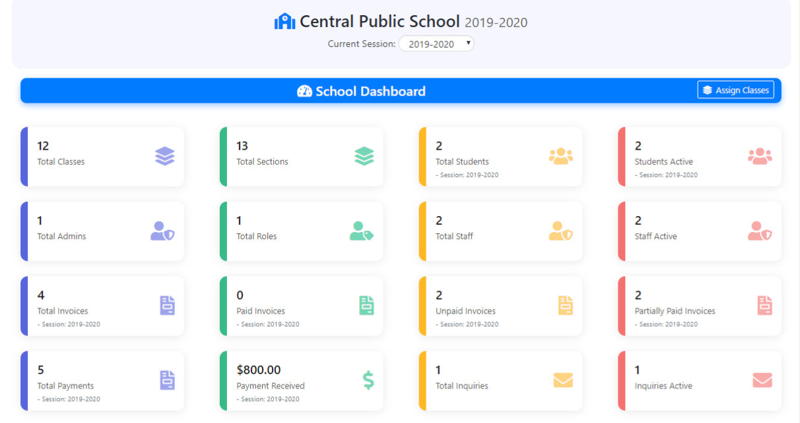

# Uniportal – University Information Portal (Static Website)

A simple, responsive landing website for a university portal that showcases key features, process highlights, and dashboard screenshots. The site is fully static and can be opened directly in a browser. It uses Bootstrap for layout, lightweight JavaScript for interactions, and common UI libraries for animations, carousels, and counters.

## Features
- Responsive layout with Bootstrap
- On‑scroll animations (WOW.js + Animate.css)
- Image/content carousel (Owl Carousel)
- Statistic counters (CounterUp + Waypoints)
- Smooth scrolling and easing
- Clean, easily customizable structure

## Tech Stack
- HTML5 (index.html)
- CSS/Sass
  - Bootstrap 5 (source SCSS under `scss/bootstrap/`, compiled CSS under `css/`)
  - Custom styles in `css/style.css`
- JavaScript (custom scripts in `js/main.js`)
- Third‑party libraries (bundled in `lib/`):
  - Animate.css, WOW.js
  - Owl Carousel
  - Waypoints, CounterUp
  - Easing

## Project Structure
```
uniportal/
├─ index.html                 # Main static page
├─ css/
│  ├─ bootstrap.min.css       # Compiled Bootstrap CSS
│  └─ style.css               # Custom site overrides
├─ js/
│  └─ main.js                 # Initialization and UI behaviors
├─ img/                       # Images and screenshots
├─ lib/                       # Third‑party libraries (js/css/assets)
│  ├─ animate/
│  ├─ counterup/
│  ├─ easing/
│  ├─ owlcarousel/
│  ├─ waypoints/
│  └─ wow/
└─ scss/
   └─ bootstrap/              # Bootstrap 5 source SCSS (customizable)
```

## Getting Started
No build step is required.

- Option 1: Open directly
  1. Download/clone the repository
  2. Open `index.html` in your browser

- Option 2: Serve locally (recommended for testing)
  - Using Python 3: `python3 -m http.server 8080` then visit http://localhost:8080

### Optional: Customize Bootstrap via SCSS
If you want to adjust Bootstrap variables or rebuild Bootstrap CSS:

1. Edit variables under `scss/bootstrap/scss/_variables.scss` (or other partials)
2. Compile SCSS to CSS (requires Sass CLI):
   - Install Sass: https://sass-lang.com/install
   - Compile:
     ```bash
     sass scss/bootstrap/bootstrap.scss css/bootstrap.min.css --style=compressed
     ```
3. Add further site‑specific styles in `css/style.css`

## Customization Guide
- Content: edit sections directly in `index.html`
- Styles: use `css/style.css` for quick overrides; prefer SCSS to change Bootstrap defaults
- Images: replace assets in `img/` and update references in `index.html`
- JavaScript: update behavior and plugin options in `js/main.js` (e.g., Owl Carousel, WOW.js, CounterUp)

## Screenshots
Images are available in `img/`. Example:



## License
All rights reserved. If you intend to open‑source this project, replace this section with your chosen license (e.g., MIT, Apache‑2.0).

## Acknowledgements
- Bootstrap (https://getbootstrap.com)
- Animate.css (https://animate.style) and WOW.js
- Owl Carousel (https://owlcarousel2.github.io/OwlCarousel2/)
- Waypoints (http://imakewebthings.com/waypoints/) and CounterUp
- jQuery/Vanilla JS plugins as included in `lib/`
